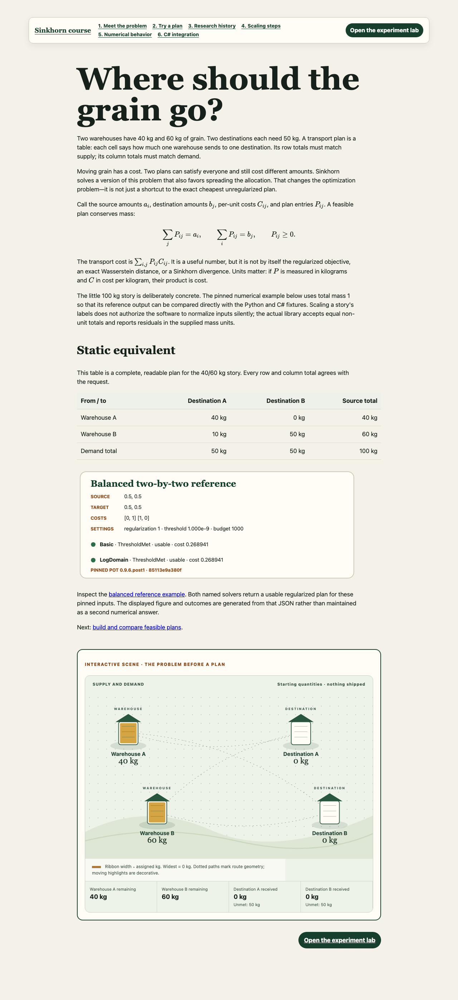

# Sinkhorn Lab

Sinkhorn Lab is a six-chapter optimal-transport course and experiment lab backed by the actual reusable C# Sinkhorn library. The browser edits and presents scenarios; the ASP.NET Core API calls the pinned numerical implementation. There is no TypeScript solver, database, account, telemetry, external API, API key, or cloud service.



## Run the packaged application

Prerequisites are Git with submodule support and a Docker-compatible container engine with Compose. The first build needs network access and can take several minutes while it downloads pinned images and packages.

```sh
git clone --recurse-submodules https://github.com/jayaraman-venkatesan/sinkhorn-lab.git
cd sinkhorn-lab
git submodule update --init --recursive
git submodule status
docker compose up --build
```

Open <http://127.0.0.1:8080>. Stop it with `docker compose down`. If port 8080 is occupied, copy `.env.example` to `.env`, change `APP_PORT`, and run the same Compose command; for example, `APP_PORT=18080 docker compose up --build`. The host mapping remains loopback-only. Offline starts work only after all referenced image layers and package inputs are already cached.

The final image runs `dotnet Api.dll` as the unprivileged `app` user. Node is used only in the frontend build stage and is absent from the final runtime. The image serves website and API from one origin.

## Architecture and status semantics

```text
browser (React, Markdown, SVG) -> same-origin ASP.NET Core API -> pinned C# library
```

The library submodule is pinned to `5bc2a85fe1856fd9352af8cddca59d8ebda81d4d`. Its Basic and LogDomain solvers preserve the selected POT 0.9.6.post1 behavior at `85113e9a380f5fcf684c50c73c1ff6a164a7366e`. See [the API contract](docs/api.md), [project vocabulary](CONTEXT.md), and [architecture decisions](docs/adr/0001-reusable-core.md).

`GET /api/health` returns `{"status":"ready"}` after startup. `POST /api/solve` accepts 1–8 source and destination entries, a request identity of 1–256 characters, at most 1,000 update pairs, and an optional phase trace. The service caps request bodies at 256 KiB, responses at 4 MiB, retained trace frames at 200, active solves at one, and compute time at 30 seconds.

HTTP 200 means the solver completed, not necessarily that its plan is usable. Inspect `termination`, finite/nonnegative checks, marginal residuals, and `checks.usable`. Iteration exhaustion and numerical breakdown remain honest numerical outcomes. Invalid requests are 400, compute timeout is 408, oversized requests are 413, concurrent solves are 429, and an essential response that cannot fit is 500.

## Local development and verification

Install Node 24 LTS and the .NET SDK pinned by `global.json`, then initialize the submodule. Commands are deliberately machine-independent:

```sh
git submodule update --init --recursive
dotnet restore --locked-mode
dotnet test -c Release --no-restore
dotnet format --verify-no-changes --no-restore
dotnet build -c Release --no-restore

cd web
npm ci
npx playwright install chromium
npm test -- --run
npm run typecheck
npm run lint
npm run build
npm run test:e2e
```

Playwright's Chromium binary is a separate prerequisite from the npm packages. A repository-clean checkout on a machine that has run Playwright before may reuse its browser cache; a fresh machine must run the install command above. On a supported Debian/Ubuntu host or in CI, `npx playwright install --with-deps chromium` also installs required operating-system libraries and may require package-install privileges.

For interactive frontend development, run `ASPNETCORE_URLS=http://127.0.0.1:5080 dotnet run --project src/Api/Api.csproj --no-restore` from the repository root and `npm run dev` from `web/`. Vite proxies `/api` to the local API.

The packaged browser suite runs against an already-started service:

```sh
cd web
PLAYWRIGHT_BASE_URL=http://127.0.0.1:8080 npm run test:packaged
```

This runs the full browser suite against the built single-origin service. The included deployment acceptance verifies the built home page, readiness endpoint, an actual pinned-library solve, and chapter-specific rendering before and after a nested lesson reload. Use `npm run test:deployment` for that focused acceptance alone. See [verification evidence](docs/verification.md) for tested image architectures, digests, clean-checkout procedure, limitations, and exact commands.

## Lessons, fixtures, and figures

The six files under `content/lessons/` are the ordinary Markdown source for both repository readers and the website. Keep lesson asset destinations relative to the Markdown file: use `../figures/<name>.svg` and `../examples/<name>.json`, not machine paths or generated `/assets/` URLs. The browser build resolves those repository-relative destinations. Stable JSON examples under `content/examples/` drive tables and scenes. Original synthetic SVGs under `content/figures/` provide non-interactive equivalents; no paper figures or stock photographs are copied.

After intentionally changing an approved example, regenerate the original figures and check all narrative/results against the pinned C# fixtures:

```sh
node scripts/render-figures.mjs
node scripts/verify-content.mjs
dotnet run --project examples/LessonUsage/LessonUsage.csproj -c Release --no-restore
```

The verifier also ensures the compiled lesson snippet below is identical to `examples/LessonUsage/Program.cs`.

## Library lesson example

Weights below are kilograms; regularization is on the cost scale and thresholds/residuals use the supplied mass units. Update-pair counts are solver work, not shipment frames.

<!-- lesson-usage:start -->
```csharp
using Sinkhorn;

var problem = new TransportProblem(
    [50.0, 50.0],
    [50.0, 50.0],
    new double[,] { { 0.0, 1.0 }, { 1.0, 0.0 } });

foreach (SolverKind kind in new[] { SolverKind.Basic, SolverKind.LogDomain })
{
    SolverResult result = SinkhornSolver.Solve(
        problem,
        regularization: 1.0,
        solver: kind,
        options: new SolverOptions(MaxIterations: 1000, Threshold: 1e-9));

    if (!result.Checks.Usable)
    {
        Console.Error.WriteLine(
            $"{kind}: {result.Termination}; " +
            $"source L1={result.Checks.SourceL1:R} kg; " +
            $"target L1={result.Checks.TargetL1:R} kg");
        return 1;
    }

    Console.WriteLine(
        $"{kind}: {result.AcceptedPairs} accepted update pair(s), " +
        $"transport cost {result.TransportCost:R}");
}

var zeroSupport = new TransportProblem(
    [1.0, 0.0],
    [0.0, 1.0],
    new double[,] { { 0.0, 1.0 }, { 1.0, 0.0 } });
SolverResult failed = SinkhornSolver.Solve(
    zeroSupport,
    regularization: 1.0,
    solver: SolverKind.Basic);
Console.WriteLine($"Basic zero support: {failed.Termination}");

return failed.Termination == TerminationReason.NumericalBreakdown
    && !failed.Checks.Usable
    ? 0
    : 1;
```
<!-- lesson-usage:end -->

## Scope, research, and licensing

This is educational decision support, not a validated logistics optimizer. It does not provide unbalanced transport, batching, GPU/autodiff, production routing, guaranteed convergence, or a general POT toolbox. Cost is not the regularized objective, exact Wasserstein distance, or Sinkhorn divergence. Accessibility evidence is automated Chromium coverage plus inspected screenshots; it is not a manual screen-reader or multi-browser certification.

The approved [design](docs/superpowers/specs/2026-09-19-sinkhorn-learning-design.md) links the numerical/animation contracts, technical stack research, and primary-source teaching history. POT translation credit, Cuturi/Feydy citations, locked dependency findings, KaTeX font status, original-asset provenance, and container notices are retained in [THIRD_PARTY_NOTICES.md](THIRD_PARTY_NOTICES.md).

Project code and original assets are available under the [MIT License](LICENSE). Third-party components remain under their own licenses.
