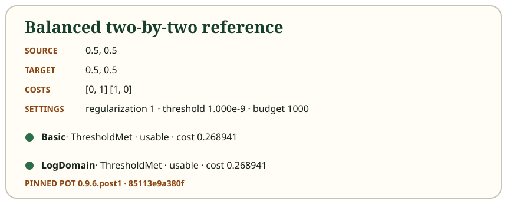

# Where should the grain go?

Two warehouses have 40 kg and 60 kg of grain. Two destinations each need 50 kg.
A transport plan is a table: each cell says how much one warehouse sends to
one destination. Its row totals must match supply; its column totals must match demand.

Moving grain has a cost. Two plans can satisfy everyone and still cost different
amounts. Sinkhorn solves a version of this problem that also favors spreading
the allocation. That changes the optimization problem—it is not just a shortcut
to the exact cheapest unregularized plan.

Call the source amounts $a_i$, destination amounts $b_j$, per-unit costs $C_{ij}$,
and plan entries $P_{ij}$. A feasible plan conserves mass:

$$
\sum_j P_{ij}=a_i,\qquad \sum_i P_{ij}=b_j,\qquad P_{ij}\ge 0.
$$

The transport cost is $\sum_{i,j}P_{ij}C_{ij}$. It is a useful number, but it is
not by itself the regularized objective, an exact Wasserstein distance, or a
Sinkhorn divergence. Units matter: if $P$ is measured in kilograms and $C$ in
cost per kilogram, their product is cost.

The little 100 kg story is deliberately concrete. The pinned numerical example
below uses total mass 1 so that its reference output can be compared directly
with the Python and C# fixtures. Scaling a story's labels does not authorize the
software to normalize inputs silently; the actual library accepts equal non-unit
totals and reports residuals in the supplied mass units.

## Static equivalent

This table is a complete, readable plan for the 40/60 kg story. Every row and
column total agrees with the request.

| From / to | Destination A | Destination B | Source total |
| --- | ---: | ---: | ---: |
| Warehouse A | 40 kg | 0 kg | 40 kg |
| Warehouse B | 10 kg | 50 kg | 60 kg |
| Demand total | 50 kg | 50 kg | 100 kg |

Inspect the [balanced reference example](../examples/balanced.json). Both named
solvers return a usable regularized plan for these pinned inputs. The displayed
figure and outcomes are generated from that JSON rather than maintained as a
second numerical answer.

Next: [build and compare feasible plans](02-manual-allocation.md).
