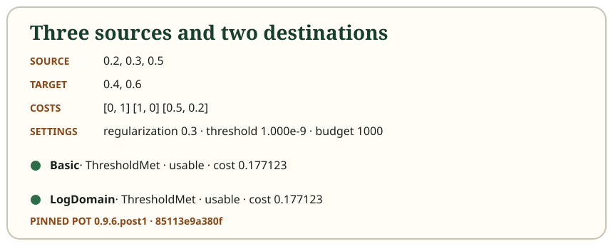

# A short history of moving mass

Optimal transport is older than its modern machine-learning uses. Monge's 1781
memoir posed a classical earth-moving question: rearrange equal amounts of
material while minimizing transport cost. It should not be read as a claim that
Monge solved every formulation now called optimal transport. The checked
[SMF/BnF bibliography](https://smf.emath.fr/smf-dossiers-et-ressources/bibliographie-j-delon-bnf-2021)
and [Appell's historical exposition](https://www.numdam.org/item/MSM_1928__27__1_0/)
locate that milestone.

Kantorovich's 1942 formulation permits a transport plan to divide material from
one source among several destinations. In a finite problem, the allocation
becomes linear optimization. The [CERN institutional record](https://cds.cern.ch/record/739801/)
dates the original work to 1942; a later English translation is not the original
publication date.

Alternating matrix scaling also predates modern regularized transport. The
[1967 Sinkhorn–Knopp paper](https://msp.org/pjm/1967/21-2/pjm-v21-n2-p14-s.pdf)
states the positive-matrix result, credits Sinkhorn's 1964 work, and gives extra
conditions for matrices containing zeros. Historical doubly stochastic matrices
have every row and column sum equal to one; probability marginals instead sum
to one overall. Those are related scaling ideas, not identical statements.

[Cuturi's 2013 paper](https://arxiv.org/pdf/1306.0895) connected
entropy-regularized transport with efficient matrix scaling and machine-learning
experiments. It did not invent transport, entropy, or alternating scaling. The
paper writes inverse regularization as $\lambda$; this course uses
$\varepsilon=1/\lambda$. Smaller $\varepsilon$ means a sharper cost preference.

Later work studies other quantities. [Feydy and coauthors (2019)](https://proceedings.mlr.press/v89/feydy19a/feydy19a.pdf)
analyze a debiased Sinkhorn divergence under stated assumptions. That quantity
subtracts self-comparison terms; it is not the transport-cost field returned by
this library, and it is not automatically a metric satisfying the triangle inequality.

## Static equivalent

| Milestone | Safe takeaway |
| --- | --- |
| Monge, 1781 | A classical minimum-cost rearrangement question |
| Kantorovich, 1942 | Divisible mass represented by a transport plan |
| Sinkhorn, 1964; Sinkhorn–Knopp, 1967 | Alternating scaling and its matrix conditions |
| Cuturi, 2013 | Efficient entropy-regularized OT for modern computation |
| Feydy et al., 2019 | Analysis of a later debiased quantity |

The [rectangular reference example](../examples/rectangular.json) shows that a
transport plan need not be square, even though a historical theorem may be
introduced through square doubly stochastic matrices.

Next: [see the regularized objective and updates](04-regularization.md).
