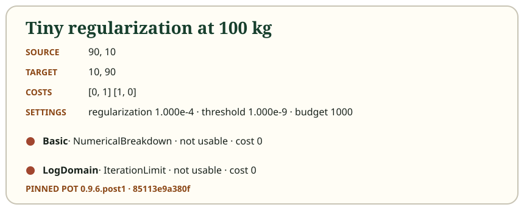

# Basic and LogDomain are honest about failure

Basic and LogDomain preserve the same reference update order but use different
coordinates. Basic directly scales a kernel, so very small regularization can
underflow entries or overflow scalings. LogDomain keeps logarithmic scalings and
uses log-sum-exp, which often extends the useful numerical range. It is the
pinned `sinkhorn_log` behavior, not a different “stabilized” solver and not a
guarantee of convergence.

Termination and plan validity are separate. `ThresholdMet`, `IterationLimit`,
and `NumericalBreakdown` describe how the calculation stopped. A usable plan
additionally requires finite, nonnegative entries and both final marginal L1
errors below the requested threshold. A finite plan can be unusable; a low
transport cost can be meaningless when demand was not met.

The tiny-regularization 100 kg reference makes that concrete. Basic rejects its
last attempted pair and restores the previous finite state. The restored matrix
still sends 90 kg and 10 kg along the diagonal, leaving a target L1 error of
160 kg. LogDomain completes the full 1,000-pair budget but reaches the same
infeasible shape to floating-point precision. Neither result may drive completed
shipment playback.

Zero weights expose a different edge. For the pinned zero-support case, Basic
breaks down immediately and restores its initial state, while LogDomain returns
a usable plan. This is one observed fixture, not a general promise that one
solver always handles every zero-support problem.

## Static equivalent

| Pinned case and solver | Stop | Attempted / accepted pairs | Target L1 | Usable |
| --- | --- | ---: | ---: | --- |
| Tiny regularization, Basic | NumericalBreakdown | 322 / 321 | 160 kg | No |
| Tiny regularization, LogDomain | IterationLimit | 1000 / 1000 | about 160 kg | No |
| Zero support, Basic | NumericalBreakdown | 1 / 0 | 1 | No |
| Zero support, LogDomain | ThresholdMet | 1 / 1 | 0 | Yes |

Inspect [tiny regularization](../examples/tiny-regularization.json) and
[zero support](../examples/zero-support.json). Their named outcomes are copied
from pinned fixtures and checked for drift. The app does not recompute or soften
these expected values in TypeScript.

Next: [use and check the C# library](06-library-usage.md).
