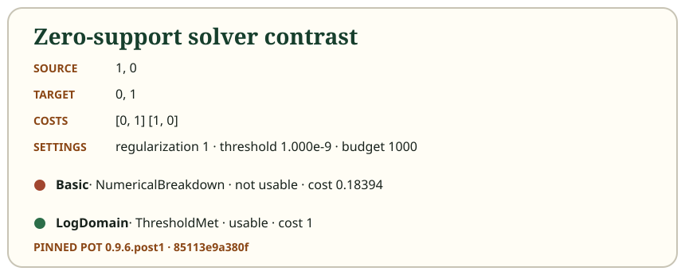

# Use the C# library and inspect the result

The reusable library accepts numbers, not warehouse objects. Construct a
`TransportProblem` with source weights, target weights, and a rectangular cost
matrix. Then choose `SolverKind.Basic` or `SolverKind.LogDomain` explicitly and
call `SinkhornSolver.Solve`. The runnable snippet in the project README exercises
both choices and a deliberate zero-support failure.

Check `result.Termination` and `result.Checks.Usable` before using the plan.
Inspect source and target L1 residuals, warnings, and the returned matrix when a
call exhausts its budget or breaks down. Such a call returns diagnostic evidence;
it is not disguised as an exception or completed delivery. Invalid arguments,
by contrast, are rejected before iteration.

If weights mean kilograms, residuals and the absolute stopping threshold also
use kilograms. A threshold of $10^{-9}$ kg has a different practical meaning
from $10^{-9}$ probability mass. Regularization has the same scale as cost: if
every cost is multiplied by 100 while regularization stays fixed, you changed
the problem's sharpness. The library performs no normalization, cost shifting,
support reduction, solver fallback, or unit conversion.

Iteration fields report numerical work. `LastAttemptedIndex` is zero-based;
`AttemptedPairs` counts update pairs tried; `AcceptedPairs` excludes a rejected
Basic pair that was rolled back. Solver-trace frames are sampled numerical
states. Shipment playback time, steps, and decorative particles are presentation
concepts and never change those counts.

Possible uses include comparing image color distributions, research image
classification, and fitting synthetic point clouds. Those examples require
domain-specific modeling and validation. Palette transport alone does not know
objects or spatial layout, and this educational warehouse app is not a validated
production logistics optimizer.

## Static equivalent

| Result field | Question to ask before use |
| --- | --- |
| `Termination` | Did the threshold pass, the budget end, or arithmetic break down? |
| `Checks.Usable` | Are termination, both residuals, finiteness, and nonnegativity acceptable? |
| `TransportCost` | Is the plan feasible, and are the units understood? |
| `AttemptedPairs` / `AcceptedPairs` | Was an attempted Basic update restored? |
| `Warnings` | Is exhaustion, breakdown, or diagnostic overflow disclosed? |

The [zero-support example](../examples/zero-support.json) is a compact reminder
to branch on result status rather than treating any returned matrix as a shipment.
For provenance, the implementation follows POT 0.9.6.post1 at commit
`85113e9a380f5fcf684c50c73c1ff6a164a7366e` and preserves its notice. Historical
credit and research boundaries are summarized in the previous chapters.

Continue in the [interactive experiment lab](/lab).
